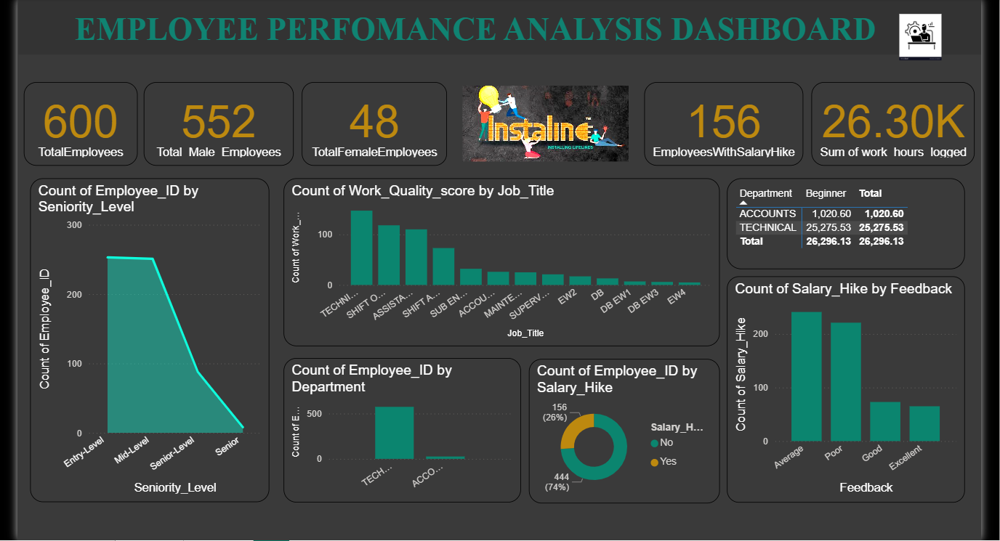
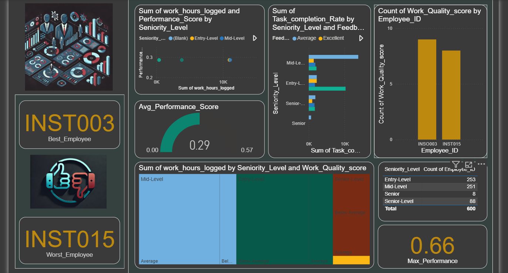

# Employee Performance Analysis Project

## 📌 Project Overview
This project focuses on analyzing employee performance using machine learning techniques and visualizing insights through Power BI dashboards. The goal is to derive actionable insights to improve employee productivity and organizational decision-making.

---

## 🛠️ Tools & Technologies
- Python
- Pandas, NumPy
- Scikit-learn
- Matplotlib, Seaborn
- Power BI

---

## 📊 Key Features
- Data preprocessing and feature engineering
- Performance prediction using:
  - Random Forest Regressor
  - Support Vector Machine (SVM)
  - Logistic Regression
- Employee performance scoring and ranking system
- Model evaluation using MAE, MSE, R² Score, Accuracy
- Exported datasets for Power BI dashboard creation

---

## 📈 Machine Learning Models Used
- Random Forest (for performance prediction)
- Support Vector Classifier (for feedback classification)
- Logistic Regression (for salary hike prediction)

---

## 📊 Outputs
- Processed dataset for Power BI visualization
- Ranked employee performance dataset
- Accuracy comparison of models
- Dashboard visual insights

---

## 📷 Dashboard Preview
### Page 1


### Page 2


---

## 🚀 How to Run the Project
1. Install required libraries:
   ```bash
   pip install pandas scikit-learn matplotlib seaborn
   ```

2. Run the Python script:
   ```bash
   python Emp_Performance.py
   ```

---

## 📌 Business Insights
- Identifies top-performing employees based on performance score
- Helps in decision-making for promotions and salary hikes
- Tracks employee engagement and productivity trends
